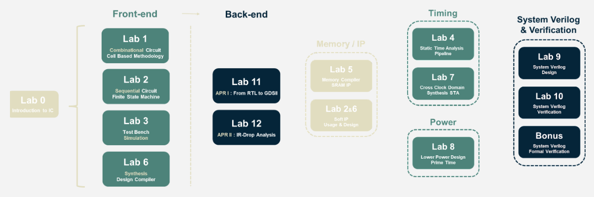
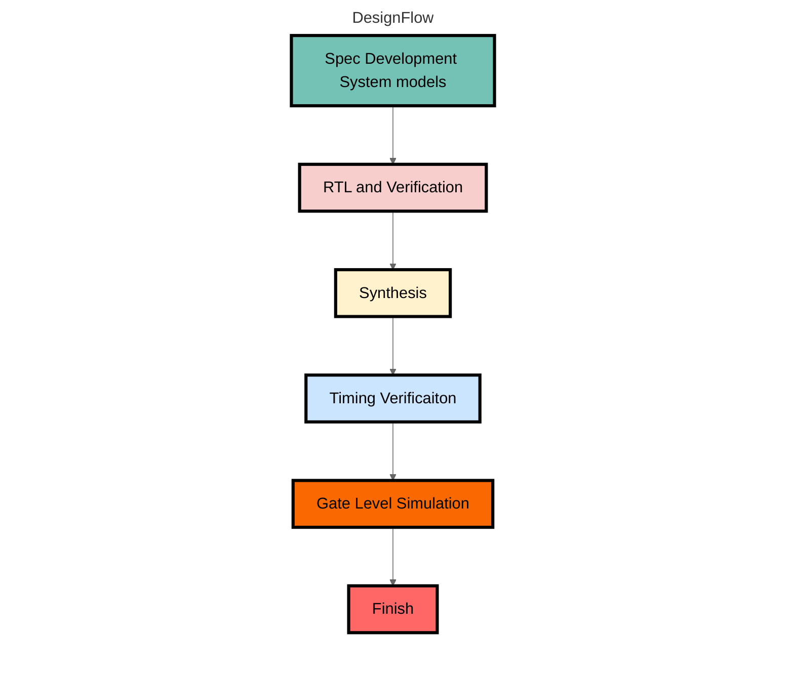

# NYCU ICLAB writeup (2021 Fall)
This repository is used to practice the labs from Prof. Chen-Yi Lee's IC Design Lab (ICLab) course (2021 Fall) at NYCU.



## Practices
* Practice01 - Simulation flow : [[spec](./Practices/Lab01_Practice.pdf)] [[design](./Practices/Practice01/CORE.v)]
* Practice02 - Complex Number Calculator : [[spec](./Practices/Practice02/Lab02_Practice.pdf)] [[design](./Practices/Practice02/CNC.v)]
* Practice03 - Vector Reverse Ordering : [[spec](./Practices/Practice03/Lab03_Practice.pdf)]
* Practice04 - Vector Inner Product : [[spec](./Practices/Practice04/Lab04_Practice.pdf)] [[design](./Practices/Practice04/VIP.v)]
* Practice05 - Queue and Stack : [[spec](./Practices/Practice05/Lab05_Practice.pdf)]
* Practice06 - Complex Multiplier (Genvar Version) : [[spec](./Practices/Practice06/Lab06_Practice.pdf)]
* Practice07 - Convolution : [[spec](./Practices/Practice07/Lab07_Practice.pdf)]
* Practice08 - Image Processing (IP) : [[spec](./Practices/Practice08/Lab08_Practice.pdf)]
* Practice09 - Coffee Maker (CM) : [[spec](./Practices/Practice09/Lab09_Practice.pdf)]
* Practice12 - Power Rail Analysis (PRA) : [[spec](./Practices/Practice12/Lab12_Practice.pdf)]

## Labs
* Lab01 - Supper MOSFET Calculator (SMC) : [[spec](./Labs/Lab01/Lab01_Exercise.pdf)] [[design](./Labs/Lab01/SMC.v)]
* Lab02 - Knight’s Tour (KT) : [[spec](./Labs/Lab02/Lab02_Exercise.pdf)]
* Lab03 - Maze : [[spec](./Labs/Lab03/Lab03_Exercise.pdf)]
* Lab04 - Artificial Neural Network (NN) [[spec](./Labs/Lab04/Lab04_Exercise.pdf)]
* Lab05 - Template Matching with Image Processing (TMIP) [[spec](./Labs/Lab05/Lab05_Exercise.pdf)]
* Lab06 - Check Sum (CS) : [[spec](./Labs/Lab06/Lab06_Exercise.pdf)]
* Lab07 - Cross Domain Clock (CDC) : [[spec](./Labs/Lab07/Lab07_Exercise.pdf)]
* Lab08 - Series Processiong (SP) : [[spec](./Labs/Lab08/Lab08_Exercise.pdf)]
* Lab09 - Pokemon Simulation Game (PSG) : [[spec](./Labs/Lab09/Lab09_Exercise.pdf)]
* Lab10 - PSG (From Lab09) Coverage : [[spec](./Labs/Lab10/Lab10_Exercise.pdf)]
* Lab Bonus - Formal Verification : [[spec](./Labs/Bonus/Bonus_Formal_Verification_Exercise.pdf)]
* Lab11 - Template Matching with Image Processing (TMIP) : [[spec](./Labs/Lab11/Lab11_Exercise.pdf)]
* Lab12 - Knight’s Tour APRII : [[spec](./Labs/Lab12/Lab12_Exercise.pdf)]

## Design Flow


## Usage
```shell
# RTL & Verification
$ make irun_rtl

# Install Python3 thirdparty library (Optional)
$ pip3 install -r requirements.txt

# Use Python3 to generate custom testcase (Optional)
$ python3 testdata_gen.py

# RTL & Verification with custom testcase
$ make irun_rtl_cust

# Synthesis & STA report
$ make syn

# Gate level simulation
$ make irun_gate

# Gate level simulation with custom testcase
$ make irun_gate_cust

# View waveform
$ make nWave

# Debug design and check critical path
$ make verdi_rtl
$ make verdi_gate

# Clean output file
$ make clean
```

## Tool Chain
* Python3
* Cadence irun
* Synopsys Design Compiler
    * cell : UMC 0.18µm
* Synopsys Verdi